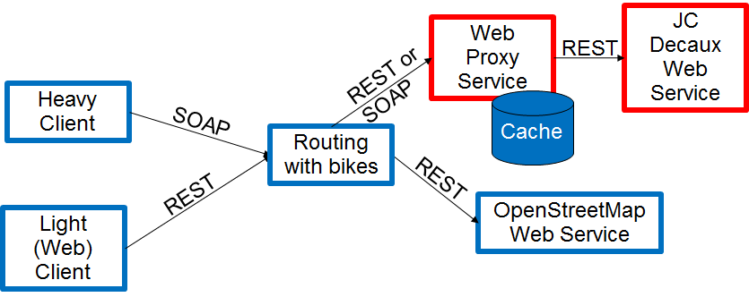

# Projet de SOC/WS : Let's Go Biking
Projet de Polytech' Nice-Sophia

## Description
Le projet "Let's Go Biking" est séparé en quatre sous projets :
- Serveur proxy (avec cache) (SOAP)
- Serveur de routing (SOAP et REST)
- Client lourd (connecté en SOAP)
- Client léger (connecté en REST)

Le serveur proxy, le serveur de routing et le client lourd sont accessibles en ouvrant la solution "LetsGoBiking.sln".  
Le client léger est accessible en ouvrant "index.html" avec un navigateur.  

Le client léger est connecté en REST au serveur de routing et le client lourd en SOAP.  
Le serveur de routing est connecté au serveur proxy en SOAP et également connecté en REST a l'API de [OpenRouteService](https://openrouteservice.org/).  
Le serveur proxy est connecté en REST a l'API de [JCdecaux](https://developer.jcdecaux.com/#/home).  

Le code de chaque sous projet est disponible dans leur dossier respectif.

## Auteur
Andréa BERRO - [Github](https://github.com/AndreaBerro)
